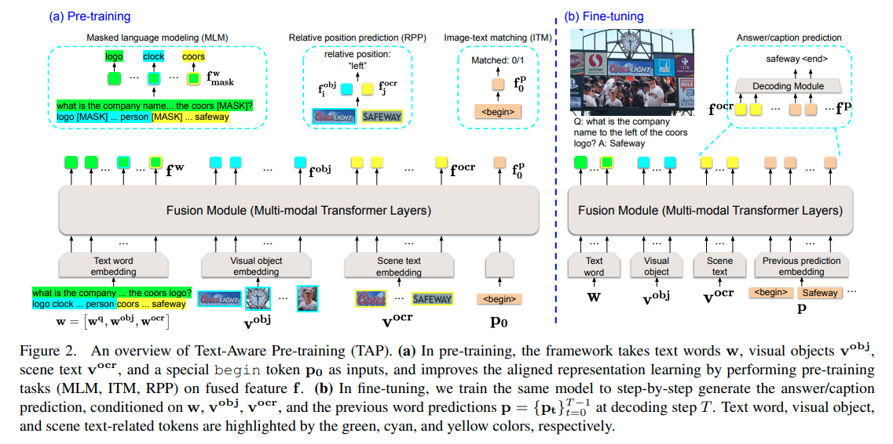

### 概要
- CVPR2021網羅的サーベイ
- 担当Topic : Vision & Language (1/2)
- 目標 : 1グループ50本
- グループメンバー
    - Norihito Ishida : 私
    - Jumpei Suzuki : UT(B4), NLP(機械読解)
    - Shintaro Yamamoto : WU(D3), CVやNLP(論文解析)
    - Ryosuke Yamada : 運営(マネジメント・メンタリング担当)
    - Hirokatsu Kataoka : 運営(主催)
- 読み終わったら `ReadingList` のフォームに 概要説明/新規性/結果 等を記入する

### Link
- [マニュアル (presentation)](https://docs.google.com/presentation/d/1ntOxWxFyZow69ibtuZMx-omdpvI2Y-GilkcQveEoA6M/edit?usp=sharing)
- [Reading List (spreadsheet)](https://docs.google.com/spreadsheets/d/1ZeR6bRU_HMSaHczQ6D1NW9Tls4oIjQmxXOmZjZWn5DA/edit?usp=sharing)
- [CVPR2021 research areas (unofficial)](https://public.tableau.com/views/CVPR2021/Dashboard1?:language=en-US&:display_count=n&:origin=viz_share_link:showVizHome=no)

### 読んだものリスト
- (1) TAP: Text-Aware Pre-Training for Text-VQA and Text-Caption
- (2) ArtEmis: Affective Language for Visual Art

### TAP: Text-Aware Pre-Training for Text-VQA and Text-Caption
|Topic|Description|
|---|---|
|タイトル|TAP: Text-Aware Pre-Training for Text-VQA and Text-Caption|
|日付|2020/12/08|
|著者|Zhengyuan Yang, Yijuan Lu, Jianfeng Wang, Xi Yin, Dinei Florencio, Lijuan Wang, Cha Zhang, Lei Zhang, Jiebo Luo|
|リンク|[CVPR 2021 open access](https://openaccess.thecvf.com/content/CVPR2021/html/Yang_TAP_Text-Aware_Pre-Training_for_Text-VQA_and_Text-Caption_CVPR_2021_paper.html), [arXiv:2012.04638 [cs.CV]](https://arxiv.org/abs/2012.04638)|
|概要|Text-VQA/Text-Captionのための画像/文章マルチモーダルpre-traning (TAP : Text-Aware Pre-Training) を提案|
|新規性|"Text word embedding", "Visual object embedding", "Scene text embedding"を Multi-modal Transformer Layer に入力し、"Masked language modeling", "Relative position prediction", "Image-text matching"の pre-training を行う|
|結果|既存手法より性能向上 (+8.3% accuracy on TextVQA, +8.6% accuracy on ST-VQA, +10.2 CIDEr score on TextCaps)|
|備考||

### ArtEmis: Affective Language for Visual Art
|Topic|Description|
|---|---|
|タイトル|ArtEmis: Affective Language for Visual Art|
|日付|2020/12/08|
|著者|Panos Achlioptas, Maks Ovsjanikov, Kilichbek Haydarov, Mohamed Elhoseiny, Leonidas J. Guibas|
|リンク|[CVPR 2021 open access](https://openaccess.thecvf.com/content/CVPR2021/html/Achlioptas_ArtEmis_Affective_Language_for_Visual_Art_CVPR_2021_paper.html), [	arXiv:2101.07396 [cs.CV]](https://arxiv.org/abs/2101.07396)|
|概要||
|新規性||
|結果||
|備考||